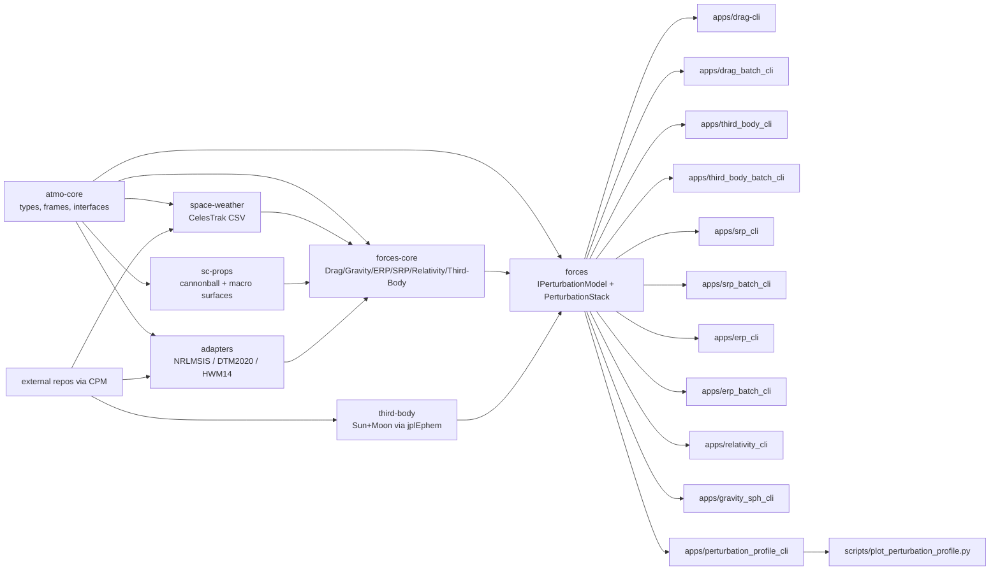

# astrodynamics-forces-cpp

Unified C++20 astrodynamics perturbation modeling platform.

## Architecture


## Scope
- Shared force interfaces (`IPerturbationModel`, `PerturbationStack`)
- Drag acceleration core (relative velocity + ballistic term)
- Spacecraft geometry/surface property hooks
- Adapter integration points for:
  - NRLMSIS 2.1 (`nrlmsis-2_1`)
  - DTM2020 (`dtm2020`)
  - HWM14 (`hwm14`)

## Build
```bash
cmake --preset macos-debug
cmake --build --preset macos-debug
ctest --preset macos-debug --output-on-failure
```

External model repos are pulled via CPM with HTTPS URLs by default; override cache vars
`ASTROFORCES_NRLMSIS21_REPO`, `ASTROFORCES_DTM2020_REPO`, and `ASTROFORCES_HWM14_REPO` if you prefer SSH.

## CLI
```bash
./build/macos-debug/drag_cli 6778137 0 0 0 7670 0 1000000000
```

Batch CLI:
```bash
./build/macos-debug/drag_batch_cli input.csv output.csv csv nrlmsis /path/to/msis21.parm zero "" /path/to/SW-Last5Years.csv
```
Input row format:
- `epoch_utc_s,x_m,y_m,z_m,vx_mps,vy_mps,vz_mps`
- Output schema reference: `docs/DRAG_OUTPUT_SCHEMA.md`

Optional weather input:
- Pass CelesTrak 5-year CSV as final arg:
```bash
./build/macos-debug/drag_cli 6778137 0 0 0 7670 0 1000000000 nrlmsis /path/to/msis21.parm zero "" /path/to/SW-Last5Years.csv
```

Third-body single-state CLI:
```bash
./build/macos-debug/third_body_cli 6778137 0 0 0 7670 0 1000000000 /path/to/linux_p1550p2650.440 1 1
```

Third-body batch CLI:
```bash
./build/macos-debug/third_body_batch_cli input_eci.csv third_body_output.csv /path/to/linux_p1550p2650.440 1 1
```
Input row format:
- `epoch_utc_s,x_eci_m,y_eci_m,z_eci_m,vx_eci_mps,vy_eci_mps,vz_eci_mps`
- Output schema reference: `docs/THIRD_BODY_OUTPUT_SCHEMA.md`

Weather mapping notes:
- CelesTrak KP columns are parsed in tenths and converted to 0-9 scale.
- `kp_3h_current` is used for DTM delayed 3-hour Kp input.
- Daily `kp` is used for DTM 24-hour mean Kp input.
- `ap_msis_history` is computed from 3-hour AP slots and passed through the NRLMSIS adapter.

Drag area modes:
- Cannonball: set `use_surface_model=false`; area is fixed at `reference_area_m2`.
- Macro-model: set `use_surface_model=true` with surfaces; projected area is computed from plate normals and flow direction in body frame.
- Body-frame flow direction uses `StateVector::body_from_frame_dcm` (row-major DCM).

General perturbation interface:
- Use `astroforces::forces::IPerturbationModel` for each force source.
- Combine models with `astroforces::forces::PerturbationStack`.
- Drag is exposed as `astroforces::forces::DragPerturbationModel` and plugs directly into the same stack as gravity/SRP/third-body models.
- Third-body is exposed as `astroforces::forces::ThirdBodyPerturbationModel` (Sun/Moon direct + indirect terms via JPL ephemerides).
- ERP is exposed via `astroforces::forces::ErpAccelerationModel` and `astroforces::forces::ErpPerturbationModel`.
- SRP is exposed via `astroforces::forces::SrpAccelerationModel` and `astroforces::forces::SrpPerturbationModel`.
- Relativity is exposed via `astroforces::forces::RelativityAccelerationModel` and `astroforces::forces::RelativityPerturbationModel`.
- Gravity+tides is exposed via `astroforces::forces::GravitySphAccelerationModel` and `astroforces::forces::GravitySphPerturbationModel`.
- Drag, ERP, and SRP all use the shared surface-force kernel (`astroforces::forces::evaluate_surface_force`) for cannonball/macro area+coefficient handling.

Gravity+tides single-state CLI:
```bash
./build/macos-debug/gravity_sph_cli 6778137 0 0 0 7670 0 1000000000 /path/to/EGM2008.gfc 120 eci /path/to/linux_p1550p2650.440 1
```
Model notes reference: `docs/GRAVITY_MODEL_NOTES.md`

ERP single-state CLI:
```bash
./build/macos-debug/erp_cli 6778137 0 0 0 7670 0 1000000000 600 4 1.3
```

ERP batch CLI:
```bash
./build/macos-debug/erp_batch_cli input_eci.csv erp_output.csv 600 4 1.3
```
Output schema reference: `docs/ERP_OUTPUT_SCHEMA.md`

Relativity single-state CLI:
```bash
./build/macos-debug/relativity_cli 6778137 0 0 0 7670 0 1000000000 /path/to/linux_p1550p2650.440 1
```
Output schema reference: `docs/RELATIVITY_OUTPUT_SCHEMA.md`
Model notes reference: `docs/RELATIVITY_MODEL_NOTES.md`

SRP single-state CLI:
```bash
./build/macos-debug/srp_cli 6778137 0 0 0 7670 0 1000000000 /path/to/linux_p1550p2650.440 600 4 1.3 0
```

SRP batch CLI:
```bash
./build/macos-debug/srp_batch_cli input_eci.csv srp_output.csv /path/to/linux_p1550p2650.440 600 4 1.3 0
```
Output schema reference: `docs/SRP_OUTPUT_SCHEMA.md`

Perturbation-vs-altitude profiling:
```bash
./build/macos-debug/perturbation_profile_cli perturbation_profile.csv 200 20000 500 \
  /path/to/DTM_2020_F107_Kp.dat \
  /path/to/SW-Last5Years.csv \
  /path/to/linux_p1550p2650.440 \
  1000000000 \
  /path/to/EIGEN-6S4.gfc \
  120
python3 scripts/plot_perturbation_profile.py perturbation_profile.csv --output-stem perturbation_vs_altitude --column single
```
This generates publication-ready IEEE-style PDF/PNG plots of acceleration magnitude by perturbation component versus altitude.
Output columns include:
- `drag_mps2`
- `gravity_central_mps2`
- `gravity_sph_mps2`
- `gravity_tide_sun_mps2`
- `gravity_tide_moon_mps2`
- `erp_mps2`
- `relativity_mps2`
- `srp_mps2` (if ephemeris provided)
- `third_body_sun_mps2`
- `third_body_moon_mps2`
- `total_mps2`

Notes:
- Third-body columns are component-based and extensible for future bodies (additional `*_mps2` columns).
- Plot output intentionally omits the `total_mps2` curve and focuses on component lines.
- Output schema reference: `docs/PERTURBATION_PROFILE_SCHEMA.md`.

Gravity coefficient sources:
- Primary catalog/download portal: `https://icgem.gfz.de/tom_longtime`
- Recommended reference model for comparison: `EIGEN-6S4 (Version 2)` (GFZ/GRGS), DOI `10.5880/icgem.2016.008`.
- Repo-local example path (ignored by git): `data/local/EIGEN-6S4.gfc`.

Performance benchmark:
```bash
./build/macos-debug/astroforces_perf_benchmark
```
Environment controls:
- `ASTRO_FORCES_PERF_SAMPLES` (default `40`)
- `ASTRO_FORCES_PERF_ITERS` (default `5000`)
