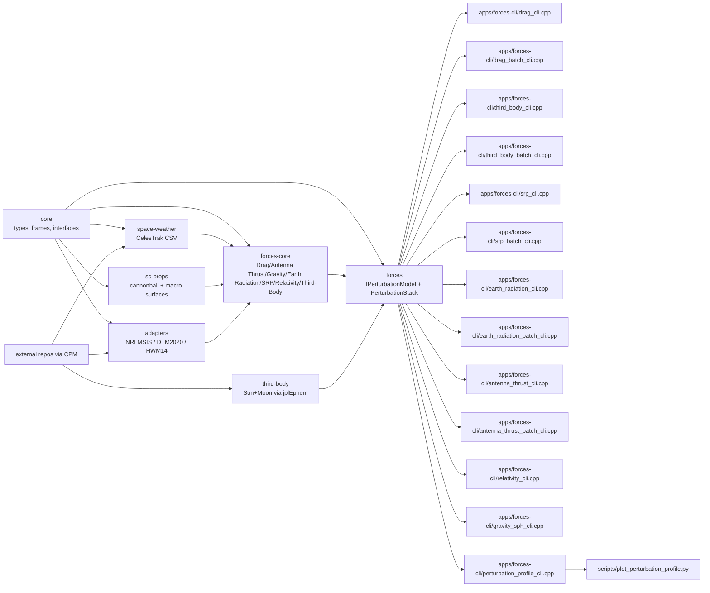

# astroforces

Unified C++20 astrodynamics perturbation modeling platform.

## Architecture


## Scope
- Core astrodynamics primitives and transforms:
  - Frame/time types, EOP/CIP readers, leap-second handling
  - Approximate and strict ECI/ECEF transform paths
- Shared force composition interface:
  - `IPerturbationModel`, `PerturbationStack`, typed contribution outputs
- Implemented force models:
  - Surface forces: Drag, SRP, Earth Radiation Pressure (ERP), Antenna Thrust
  - Gravity forces: Central + SPH gravity, solid Earth/pole/ocean/atmos/AOD tide terms
  - Other forces: Third-body (Sun/Moon), Post-Newtonian relativity
- Spacecraft geometry/properties:
  - Cannonball and macro-surface projection models
- Weather/model adapters:
  - NRLMSIS 2.1 (`nrlmsis-2_1`)
  - DTM2020 (`dtm2020`)
  - HWM14 (`hwm14`)
  - CelesTrak SW-Last5Years CSV provider

## Build
```bash
cmake --preset macos-debug
cmake --build --preset macos-debug
ctest --preset macos-debug --output-on-failure
```

External model repos are pulled via CPM with HTTPS URLs by default; override cache vars
`ASTROFORCES_NRLMSIS21_REPO`, `ASTROFORCES_DTM2020_REPO`, and `ASTROFORCES_HWM14_REPO` if you prefer SSH.

## CLI
```bash
./build/macos-debug/drag_cli 6778137 0 0 0 7670 0 1000000000
```

Batch CLI:
```bash
./build/macos-debug/drag_batch_cli input.csv output.csv csv nrlmsis /path/to/msis21.parm zero "" data/required/SW-Last5Years.csv
```
Input row format:
- `epoch_utc_s,x_m,y_m,z_m,vx_mps,vy_mps,vz_mps`
- Output schema reference: `docs/DRAG_OUTPUT_SCHEMA.md`

Optional weather input:
- Pass CelesTrak 5-year CSV as final arg:
```bash
./build/macos-debug/drag_cli 6778137 0 0 0 7670 0 1000000000 nrlmsis /path/to/msis21.parm zero "" data/required/SW-Last5Years.csv
```

Third-body single-state CLI:
```bash
./build/macos-debug/third_body_cli 6778137 0 0 0 7670 0 1000000000 data/required/linux_p1550p2650.440 1 1
```

Third-body batch CLI:
```bash
./build/macos-debug/third_body_batch_cli input_eci.csv third_body_output.csv data/required/linux_p1550p2650.440 1 1
```
Input row format:
- `epoch_utc_s,x_eci_m,y_eci_m,z_eci_m,vx_eci_mps,vy_eci_mps,vz_eci_mps`
- Output schema reference: `docs/THIRD_BODY_OUTPUT_SCHEMA.md`

Weather mapping notes:
- CelesTrak KP columns are parsed in tenths and converted to 0-9 scale.
- `kp_3h_current` is used for DTM delayed 3-hour Kp input.
- Daily `kp` is used for DTM 24-hour mean Kp input.
- `ap_msis_history` is computed from 3-hour AP slots and passed through the NRLMSIS adapter.

Drag area modes:
- Cannonball: set `use_surface_model=false`; area is fixed at `reference_area_m2`.
- Macro-model: set `use_surface_model=true` with surfaces; projected area is computed from plate normals and flow direction in body frame.
- Body-frame flow direction uses `StateVector::body_from_frame_dcm` (row-major DCM).
- Drag frame transform modes:
  - `AutoPreferStrict` (default): use strict GCRF/ITRF when EOP+CIP data is available, otherwise fall back to GMST.
  - `ApproxGmst`: lightweight GMST-based frame conversion.
  - `StrictGcrfItrf`: full GCRF/ITRF transform using EOP + CIP series.
  - In strict mode, drag returns `Status::DataUnavailable` if required EOP/CIP samples are missing at epoch.

Leap-second handling:
- `astroforces::core::leap_seconds::active_table()` is deterministic and uses the built-in leap-second table.
- Custom tables can be loaded explicitly with `load_table_from_file(...)` when a caller-managed source is needed.

General perturbation interface:
- Use `astroforces::forces::IPerturbationModel` for each force source.
- Combine models with `astroforces::forces::PerturbationStack`.
- Drag is exposed as `astroforces::forces::DragPerturbationModel` and plugs directly into the same stack as gravity/SRP/third-body models.
- Third-body is exposed as `astroforces::forces::ThirdBodyPerturbationModel` (Sun/Moon direct + indirect terms via JPL ephemerides).
- Earth Radiation is exposed via `astroforces::forces::EarthRadiationAccelerationModel` and `astroforces::forces::EarthRadiationPerturbationModel`.
- SRP is exposed via `astroforces::forces::SrpAccelerationModel` and `astroforces::forces::SrpPerturbationModel`.
- Relativity is exposed via `astroforces::forces::RelativityAccelerationModel` and `astroforces::forces::RelativityPerturbationModel`.
- Gravity+tides is exposed via `astroforces::forces::GravitySphAccelerationModel` and `astroforces::forces::GravitySphPerturbationModel`.
- Antenna thrust is exposed via `astroforces::forces::AntennaThrustAccelerationModel` and `astroforces::forces::AntennaThrustPerturbationModel`.
- Drag, Earth Radiation, and SRP all use the shared surface-force kernel (`astroforces::forces::evaluate_surface_force`) for cannonball/macro area+coefficient handling.

Gravity+tides single-state CLI:
```bash
./build/macos-debug/gravity_sph_cli 6778137 0 0 0 7670 0 1000000000 data/required/EIGEN-6S4.gfc 120 eci data/required/linux_p1550p2650.440 1
```
Model notes reference: `docs/GRAVITY_MODEL_NOTES.md`

Earth Radiation single-state CLI:
```bash
./build/macos-debug/earth_radiation_cli 6778137 0 0 0 7670 0 1000000000 600 4 1.3 data/required/linux_p1550p2650.440
```

Earth Radiation batch CLI:
```bash
./build/macos-debug/earth_radiation_batch_cli input_eci.csv erp_output.csv 600 4 1.3 data/required/linux_p1550p2650.440
```
Output schema reference: `docs/EARTH_RADIATION_OUTPUT_SCHEMA.md`

Antenna thrust single-state CLI:
```bash
./build/macos-debug/antenna_thrust_cli 6778137 0 0 0 7670 0 1000000000 600 20 1.0 velocity
```

Antenna thrust batch CLI:
```bash
./build/macos-debug/antenna_thrust_batch_cli input_eci.csv antenna_thrust_output.csv 600 20 1.0 velocity
```
Output schema reference: `docs/ANTENNA_THRUST_OUTPUT_SCHEMA.md`

Relativity single-state CLI:
```bash
./build/macos-debug/relativity_cli 6778137 0 0 0 7670 0 1000000000 data/required/linux_p1550p2650.440 1
```
Output schema reference: `docs/RELATIVITY_OUTPUT_SCHEMA.md`
Model notes reference: `docs/RELATIVITY_MODEL_NOTES.md`

SRP single-state CLI:
```bash
./build/macos-debug/srp_cli 6778137 0 0 0 7670 0 1000000000 data/required/linux_p1550p2650.440 600 4 1.3 0
```

SRP batch CLI:
```bash
./build/macos-debug/srp_batch_cli input_eci.csv srp_output.csv data/required/linux_p1550p2650.440 600 4 1.3 0
```
Output schema reference: `docs/SRP_OUTPUT_SCHEMA.md`

Perturbation-vs-altitude profiling:
```bash
./build/macos-debug/perturbation_profile_cli perturbation_profile.csv 200 20000 500 \
  data/required/DTM_2020_F107_Kp.dat \
  data/required/SW-Last5Years.csv \
  data/required/linux_p1550p2650.440 \
  1000000000 \
  data/required/EIGEN-6S4.gfc \
  120
python3 scripts/plot_perturbation_profile.py perturbation_profile.csv --output-stem perturbation_vs_altitude --column single
```
This generates PDF/PNG plots of acceleration magnitude by perturbation component versus altitude.
Output columns include:
- `drag_mps2`
- `antenna_thrust_mps2`
- `gravity_central_mps2`
- `gravity_sph_mps2`
- `gravity_tide_sun_mps2`
- `gravity_tide_moon_mps2`
- `earth_radiation_mps2`
- `relativity_mps2`
- `srp_mps2` (if ephemeris provided)
- `third_body_sun_mps2`
- `third_body_moon_mps2`
- `total_mps2`

Notes:
- Third-body columns are component-based and extensible for future bodies (additional `*_mps2` columns).
- Plot output intentionally omits the `total_mps2` curve and focuses on component lines.
- Output schema reference: `docs/PERTURBATION_PROFILE_SCHEMA.md`.

Gravity coefficient sources:
- Primary catalog/download portal: `https://icgem.gfz.de/tom_longtime`
- Recommended reference model for comparison: `EIGEN-6S4 (Version 2)` (GFZ/GRGS), DOI `10.5880/icgem.2016.008`.
- Repo-local required data path (tracked): `data/required/EIGEN-6S4.gfc`.

Performance benchmark:
```bash
./build/macos-debug/astroforces_perf_benchmark --samples 40 --iters 5000
```
