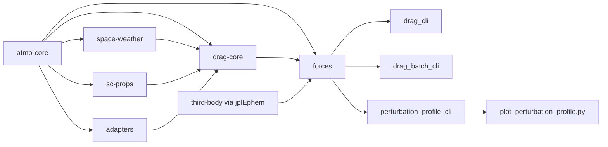

# astrodynamics-forces-cpp Architecture

## System View

## Modules
- `atmo-core`: canonical types and interfaces
- `space-weather`: providers for F10.7/Ap/Kp and related inputs
- `models-basic`: temporary baseline models for integration tests
- `adapters`: integration seam for NRLMSIS/DTM/HWM wrappers
- `sc-props`: spacecraft macro geometry and drag-relevant properties
- `drag-core`: drag acceleration pipeline + generic perturbation interfaces
- `apps/drag-cli`: single-state CLI
- `apps/drag_batch_cli`: batched drag outputs (CSV/JSON)
- `apps/perturbation_profile_cli`: altitude sweep profiler with per-component outputs
- `scripts/plot_perturbation_profile.py`: publication-style plot generation for profile CSV

## Force Abstraction
- `astroforces::forces::IPerturbationModel`: common force contribution interface.
- `astroforces::forces::PerturbationStack`: additive combiner for all perturbation models.
- `astroforces::drag::DragPerturbationModel`: drag implementation of the generic interface.
- `astroforces::forces::ThirdBodyPerturbationModel`: configurable Sun/Moon third-body model.

## Design Rules
- Preserve model kernels when integrating external repos.
- Make units and frames explicit in all interfaces.
- Keep adapters thin; keep model-specific assumptions local.
