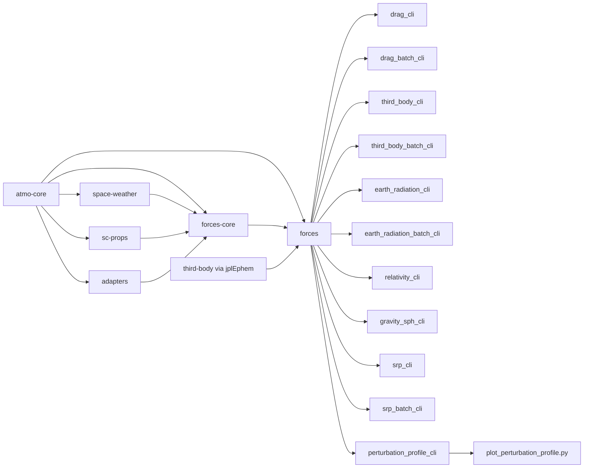

# astroforces Architecture

## System View

## Modules
- `atmo-core`: canonical types and interfaces
- `space-weather`: providers for F10.7/Ap/Kp and related inputs
- `models-basic`: temporary baseline models for integration tests
- `adapters`: integration seam for NRLMSIS/DTM/HWM wrappers
- `sc-props`: spacecraft macro geometry and drag-relevant properties
- `forces-core`: drag, full SPH gravity+tides, Earth Radiation, SRP, relativity, third-body, and generic perturbation interfaces
- `forces/surface_force`: shared surface-force kernel (cannonball + macro plate projection)
- `apps/forces-cli/drag_cli.cpp`: single-state drag evaluation
- `apps/forces-cli/drag_batch_cli.cpp`: batched drag outputs (CSV/JSON)
- `apps/forces-cli/third_body_cli.cpp`: single-state Sun/Moon third-body evaluation
- `apps/forces-cli/third_body_batch_cli.cpp`: batched Sun/Moon third-body outputs
- `apps/forces-cli/earth_radiation_cli.cpp`: single-state Earth Radiation evaluation
- `apps/forces-cli/earth_radiation_batch_cli.cpp`: batched Earth Radiation outputs
- `apps/forces-cli/relativity_cli.cpp`: single-state relativistic acceleration evaluation
- `apps/forces-cli/gravity_sph_cli.cpp`: single-state full SPH gravity and tides evaluation
- `apps/forces-cli/srp_cli.cpp`: single-state SRP evaluation
- `apps/forces-cli/srp_batch_cli.cpp`: batched SRP outputs
- `apps/forces-cli/perturbation_profile_cli.cpp`: altitude sweep profiler with per-component outputs
- `scripts/plot_perturbation_profile.py`: publication-style plot generation for profile CSV

## Force Abstraction
- `astroforces::forces::IPerturbationModel`: common force contribution interface.
- `astroforces::forces::PerturbationStack`: additive combiner for all perturbation models.
- `astroforces::forces::DragPerturbationModel`: drag implementation of the generic interface.
- `astroforces::forces::ThirdBodyPerturbationModel`: configurable Sun/Moon third-body model.
- `astroforces::forces::EarthRadiationPerturbationModel`: Earth Radiation implementation of the generic interface.
- `astroforces::forces::RelativityPerturbationModel`: relativity implementation of the generic interface.
- `astroforces::forces::GravitySphPerturbationModel`: full SPH gravity/tides implementation of the generic interface.
- `astroforces::forces::SrpPerturbationModel`: SRP implementation of the generic interface.

## Design Rules
- Preserve model kernels when integrating external repos.
- Make units and frames explicit in all interfaces.
- Keep adapters thin; keep model-specific assumptions local.
